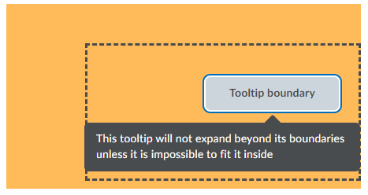

# Tooltips
## d2l-tooltip

The `d2l-tooltip` component is used to display additional information when users focus or hover on a point of interest.


```html
<script type="module">
  import '@brightspace-ui/core/components/tooltip/tooltip.js';
</script>

<d2l-input-text placeholder="Hover for Error" id="tooltip-error" aria-invalid="true"></d2l-input-text>
<d2l-tooltip for="tooltip-error" state="error" align="start" offset="10">
	Your error message will display here
</d2l-tooltip>
```

**Basic Properties:**
* `for` (required, String): provide the `id` of the tooltip's target element. If this attribute is not provided, the tooltip's parent element will be used as its target. Both the tooltip and its target element must be within the same shadow root.
* `align` (String): optionally align the tooltip with either the start or end of its target. If not set, the dropdown will attempt be centred. Valid values are: `start` and `end`.
* `delay` (Number, default: `0`) - provide a delay in milliseconds to prevent the tooltip from opening immediately when hovered. This delay will only apply to hover, not focus.
* `offset`: (Number, default: `16.5`): adjust the size of the gap between the tooltip and its target.
* `state` (String, default: `info`): the style of the tooltip based on the type of information it displays. Valid values are: `info` and `error`. If you find yourself needing a style that isn't supported by the `state` attribute please create a Github issue.

**Events:**
* `d2l-tooltip-show`: dispatched when the tooltip is opened
* `d2l-tooltip-hide`: dispatched when the tooltip is closed

### Accessibility

**Interactive Target Elements:**

If the tooltip's target is an interactive element then it will automatically be accessibile. [A list of interactive elements can be found here.](./tooltip.js#L24)

**Static / Custom Target Elements:**

If the tooltip's target is a static or custom element then the target must be both focusable and given an interactive ARIA role. Note, a role should only be added to an element if the role semantically aligns with what the element represents. [A list of interactive roles can be found here.](./tooltip.js#L38)

Adding roles to custom elements that contain internal interactive elements should be avoided to prevent the element type being announced twice. In situations like these, the tooltip should be moved inside the custom element so that it can be attached directly as shown below:
```html
<my-custom-button>
	#shadow-root (open)
		<!---->
		<button id="my-button">Click Me</button>
		<d2l-tooltip for="my-button">Your tooltip message.</d2l-tooltip>
		<!---->
</my-custom-button>
```
If you need a tooltip in a core component that does not currently support it please create a Github issue.

If you are unable to add a semantically aligned ARIA role or attach the tooltip to an interactive element then accessibility may be inconsistent across different screen readers. In these scenarios, putting critical information inside the tooltip should be avoided because some users may not be able to access it.

### Advanced Usages

**Boundaries:**

If no boundaries are provided the union of the `window` or `iframe` document and the viewport will be used. Custom boundaries should be used sparingly; however, it might be necessary to constrain a tooltip to improve user experience or to prevent it from being cut off if it has an ancestor with `overflow: hidden;`.

This can be done with the `boundary` attribute that allows any of the tooltip's `"top"`, `"bottom"`, `"left"` and `"right"` to be constrained. Boundaries are defined relative on the tooltip's [offset parent](https://developer.mozilla.org/en-US/docs/Web/API/HTMLElement/offsetParent) meaning a boundary of `{"top": 0, "bottom": 0, "left": 0, "right": 0}` will constrain the tooltip so that it opens within its offset parent's bounds.

In the following example to constrain the tooltip to the dashed boundary we can set the top boundary to `50`, the bottom boundary to `10`, the left boundary to `100`, and the right boundary to `0`.


```html
<script type="module">
  import '@brightspace-ui/core/components/tooltip/tooltip.js';
</script>

<div class="offset-parent">
	<d2l-button id="tooltip-boundary">Tooltip boundary</d2l-button>
	<d2l-tooltip for="tooltip-boundary"
		boundary="{&quot;top&quot;:50, &quot;bottom&quot;:10, &quot;left&quot;:100, &quot;right&quot;:0}">
		This tooltip will not expand beyond its boundaries unless it is impossible to fit it inside
	</d2l-tooltip>
</div>
```

**Advanced Properties:**
* `boundary` (Object) - optionally provide boundaries to constrain where the tooltip will appear. Valid properties are `"top"`, `"bottom"`, `"left"` and `"right"`. The boundary is relative to the tooltip's [offset parent](https://developer.mozilla.org/en-US/docs/Web/API/HTMLElement/offsetParent).
* `close-on-click` (Boolean, default: `false`) - causes the tooltip to close when its target is clicked
* `disable-focus-lock` (Boolean, default: `false`) - disables focus lock so that the tooltip will automatically close when no longer hovered even if it still has focus
* `force-show` (Boolean, default: `false`): force the tooltip to stay open as long as it remains `true`
* `for-type` (String, default: `descriptor`) accessibility type for the tooltip to specify whether it is the primary label for the target or a secondary descriptor. Valid values are: `label` and `descriptor`.
* `position` (String): optionally force the tooltip to open in a certain direction. Valid values are: `top`, `bottom`, `left` and `right`. If no position is provided, the tooltip will open in the first position that has enough space for it in the order: bottom, top, right, left.

## Future Enhancements

Looking for an enhancement not listed here? Create a GitHub issue!
